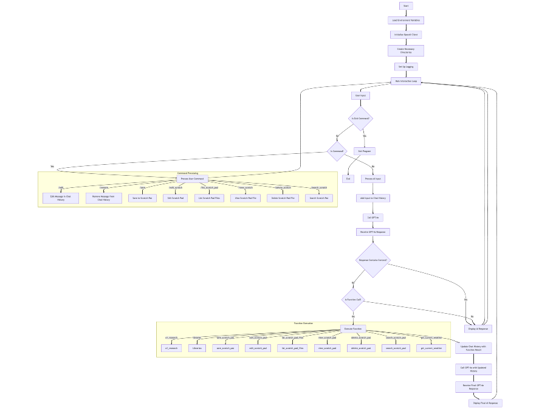

# AGI-o1



## Table of Contents

- [Overview](#overview)
- [Features](#features)
- [Architecture](#architecture)
- [Installation](#installation)
- [Configuration](#configuration)
- [Usage](#usage)
  - [Running the Application](#running-the-application)
  - [Available Commands](#available-commands)
- [Functions](#functions)
- [Directory Structure](#directory-structure)
- [Logging](#logging)
- [Contributing](#contributing)
- [License](#license)
- [Contact](#contact)

## Overview

**AGI-o1** is an advanced AI assistant powered by OpenAI's latest **GPT-5.2** and **GPT-5.2-Codex** models. Designed to handle complex user queries, perform deep reasoning with extended thinking, manage information efficiently via the ReasoningBank memory system, and provide seamless interactions through a command-line interface.

### Key Capabilities

- **GPT-5.2-Codex**: Most advanced agentic coding model (56.4% SWE-Bench Pro, 64.0% Terminal-Bench 2.0)
- **400K Context Window**: Handle massive codebases and long documents
- **128K Output Tokens**: Generate extensive code and detailed responses
- **xhigh Reasoning Effort**: Maximum thinking for the hardest challenges
- **Native Compaction**: Multi-hour reasoning without hitting context limits
- **ReasoningBank**: Persistent memory system for learning from past interactions

**Requirements:** ChatGPT Plus, Pro, Business, Edu, or Enterprise subscription for Codex access, or OpenAI API credits.

## Features

- **GPT-5.2-Codex Integration**: Advanced agentic coding with 400K context and 128K output
- **Multi-level Reasoning**: Support for none, low, medium, high, and xhigh reasoning efforts
- **ReasoningBank Memory**: Persistent memory system that learns from past interactions
- **MaTTS (Memory-aware Test-Time Scaling)**: Multi-pass reasoning with memory retrieval
- **Function Calling**: Utilizes OpenAI's tools API for specialized tasks
- **Notes System**: Save, edit, view, list, and search notes in docs/paper.txt
- **Insight Capsules**: Generate structured executive summaries
- **Task Sessions**: Interactive sub-loops for tackling specific tasks
- **Comprehensive Logging**: Detailed logs of all interactions and system events

## Architecture


**AGI-o1** follows a modular architecture where each functionality is encapsulated within dedicated functions. The system manages chat history, handles user commands, and interacts with OpenAI's API to process and respond to user inputs effectively.

## Installation

### Prerequisites

- **Python 3.10+**: Ensure you have Python installed. You can download it from [python.org](https://www.python.org/downloads/).
- **OpenAI API Key**: Obtain your API key from [OpenAI](https://platform.openai.com/account/api-keys).
- **ChatGPT Subscription**: Plus, Pro, Business, Edu, or Enterprise for Codex access.
- **Node.js 18+** (Optional): For Codex CLI and SDK integration.

### Steps

1. **Clone the Repository**

   ```bash
   git clone https://github.com/nschlaepfer/AGI-o1.git
   cd AGI-o1
   ```

2. **Create a Virtual Environment (Optional but Recommended)**

   ```bash
   python -m venv venv
   source venv/bin/activate  # On Windows: venv\Scripts\activate
   ```

3. **Install Dependencies**

   ```bash
   pip install -r requirements.txt
   ```

   *If `requirements.txt` is not provided, install the necessary packages manually:*

   ```bash
   pip install openai python-dotenv
   ```

## Configuration

1. **Environment Variables**

   Copy the example configuration and add your OpenAI API key:

   ```bash
   cp .env.example .env
   ```

   Key configuration options in `.env`:

   ```env
   # API Key (use environment-specific keys or legacy single key)
   OPENAI_API_KEY_SANDBOX=sk-...

   # Model Configuration
   OPENAI_MODEL_ASSISTANT=gpt-5.2
   OPENAI_MODEL_REASONING=gpt-5.2
   OPENAI_MODEL_REASONING_EFFORT=high  # none, low, medium, high, xhigh
   OPENAI_MODEL_CODE=gpt-5.2-codex
   OPENAI_MODEL_CODE_MAX=gpt-5.1-codex-max

   # Enable compaction for 400K context support
   OPENAI_MODEL_COMPACTION=true
   ```

   See `.env.example` and `CODEX_SETUP.md` for full configuration options.

2. **Directory Setup**

   The application will automatically create the following directories if they do not exist:

   - `logs/`: Stores log files.
   - `o1_responses/`: Stores responses from deep reasoning and coding functions.
   - `insight_capsules/`: Stores generated insight capsule JSON files.
   - `docs/`: Contains paper.txt for notes and reasoning_bank.json for memory.

## Usage

### Running the Application

Execute the main script to start interacting with AGI-o1:

```bash
python agi_o1.py
```

*Replace `agi_o1.py` with the actual filename if different.*

### Available Commands

AGI-o1 supports both natural language interactions and a set of predefined commands for managing the scratch pad and chat history. Commands are prefixed with a `/`.

#### Chat Commands

- **Exit Conversation**

  ```plaintext
  exit
  quit
  bye
  ```

  Ends the conversation with the AI assistant.

#### Scratch Pad Commands

- **Edit a Message**

  ```plaintext
  /edit <index> <new_content>
  ```

  Edits a message at the specified index in the chat history.

- **Remove a Message**

  ```plaintext
  /remove <index>
  ```

  Removes a message at the specified index from the chat history.

- **Save to Scratch Pad**

  ```plaintext
  /save <category> <filename> <content>
  ```

  Saves content to a scratch pad file within the specified category.

- **Edit Scratch Pad File**

  ```plaintext
  /edit_scratch <category> <filename> <new_content>
  ```

  Edits an existing scratch pad file within the specified category.

- **List Scratch Pad Files**

  ```plaintext
  /list_scratch_pad [category] [page]
  ```

  Lists scratch pad files, optionally within a specific category and paginated.

- **View Scratch Pad File**

  ```plaintext
  /view_scratch <category> <filename>
  ```

  Views the content of a scratch pad file within the specified category.

- **Delete Scratch Pad File**

  ```plaintext
  /delete_scratch <category> <filename>
  ```

  Deletes a scratch pad file within the specified category.

- **Search Scratch Pad Files**

  ```plaintext
  /search_scratch <query>
  ```

  Searches for a query string within all scratch pad files.

#### Example Usage

```plaintext
You: What's the weather like in New York today?
AI: The current weather in New York is sunny with a temperature of 25 degrees Celsius.

You: /save Personal Notes Meeting at 10 AM
Content saved to scratch pad as 'Personal/Notes.txt'.

You: /list_scratch_pad Personal
Available scratch pad files (Page 1/1):
Personal/Notes.txt
```

## Functions

AGI-o1 includes several built-in functions to enhance its capabilities:

### 1. `o1_research`

Performs complex reasoning for STEM (Science, Technology, Engineering, Mathematics) tasks related to the user's query.

- **Parameters**:
  - `query` (string): The STEM question to be researched.

### 2. `librarian`

Retrieves information using OpenAI's Retrieval tool.

- **Parameters**:
  - `query` (string): The query to search for information.

### 3. `save_scratch_pad`

Saves content to a scratch pad file within a specified category.

- **Parameters**:
  - `category` (string): The category under which to save the file.
  - `filename` (string): The name of the file to save the content.
  - `content` (string): The content to save in the file.

### 4. `edit_scratch_pad`

Edits content of an existing scratch pad file within a specified category.

- **Parameters**:
  - `category` (string): The category of the file to edit.
  - `filename` (string): The name of the file to edit.
  - `new_content` (string): The new content to replace the existing content.

### 5. `list_scratch_pad_files`

Lists all available scratch pad files, optionally within a specific category and paginated.

- **Parameters**:
  - `category` (string, optional): The category to list files from.
  - `page` (integer, optional): The page number to display.

### 6. `view_scratch_pad`

Views the content of a scratch pad file within a specified category.

- **Parameters**:
  - `category` (string): The category of the file to view.
  - `filename` (string): The name of the file to view.

### 7. `delete_scratch_pad`

Deletes a scratch pad file within a specified category.

- **Parameters**:
  - `category` (string): The category of the file to delete.
  - `filename` (string): The name of the file to delete.

### 8. `search_scratch_pad`

Searches for a query string within all scratch pad files.

- **Parameters**:
  - `query` (string): The string to search for within scratch pad files.

### 9. `get_current_weather`

Gets the current weather in a given location.

- **Parameters**:
  - `location` (string): The city and state, e.g., "San Francisco, CA".
  - `unit` (string, optional): Unit for temperature (`celsius` or `fahrenheit`). Defaults to `celsius`.

### Future Functions

- **`handle_image`**: Placeholder for image processing and description functionality.

## Directory Structure

```
AGI-o1/
├── logs/
│   └── chat_log_YYYYMMDD_HHMMSS.log
├── o1_responses/
│   └── o1_response_YYYYMMDD_HHMMSS.log
├── scratch_pad/
│   ├── Category1/
│   │   └── filename1.txt
│   └── Category2/
│       └── filename2.txt
├── .env
├── agi_o1.py
├── requirements.txt
└── README.md
```

- **logs/**: Contains log files documenting interactions and system events.
- **o1_responses/**: Stores responses from the `o1_research` function for later reference.
- **scratch_pad/**: Organized directories containing user-saved notes and information.
- **.env**: Environment variables, including the OpenAI API key.
- **agi_o1.py**: Main application script.
- **requirements.txt**: Lists Python dependencies.
- **README.md**: Project documentation.

## Logging

AGI-o1 employs Python's built-in `logging` module to record detailed logs of all interactions and system activities.

- **Log Files**: Stored in the `logs/` directory with filenames formatted as `chat_log_YYYYMMDD_HHMMSS.log`.
- **Logged Information**:
  - User inputs and AI responses.
  - Function calls and their parameters.
  - Errors and warnings for troubleshooting.

## Contributing

Contributions are welcome! To contribute to AGI-o1, follow these steps:

1. **Fork the Repository**

2. **Create a New Branch**

   ```bash
   git checkout -b feature/YourFeatureName
   ```

3. **Commit Your Changes**

   ```bash
   git commit -m "Add your detailed description here"
   ```

4. **Push to the Branch**

   ```bash
   git push origin feature/YourFeatureName
   ```

5. **Open a Pull Request**

Provide a clear description of your changes and the problem they solve.

### Code of Conduct

Please adhere to the [Contributor Covenant Code of Conduct](CODE_OF_CONDUCT.md) in all interactions.

## License

This project is licensed under the [MIT License](LICENSE).

## Contact

For questions, suggestions, or support, please contact:

- **GitHub**: [@nschlaepfer](https://github.com/nschlaepfer)

---

*Note: Replace placeholders like `path/to/your/diagram.png`, `your.email@example.com`, and any other placeholder text with your actual details.*

## Enhancements and Best Practices

To make the README even more effective, consider the following enhancements:

1. **Add the Architecture Diagram:**
   
   Ensure you replace `path/to/your/diagram.png` with the actual path to your architecture diagram. For example, if the diagram is in the `docs` folder:
   
   ```markdown
   
   ```

2. **Provide a `requirements.txt` File:**
   
   If not already present, create a `requirements.txt` file with the necessary dependencies:
   
   ```plaintext
   openai
   python-dotenv
   ```
   
   This allows users to install dependencies easily using `pip install -r requirements.txt`.

3. **Include Examples and Screenshots:**
   
   Adding screenshots of the application in action or example conversations can help users understand its functionality better.

4. **Detailed Contribution Guidelines:**
   
   Including a `CONTRIBUTING.md` file with detailed guidelines can streamline the contribution process.

5. **Add a License File:**
   
   Ensure you have a `LICENSE` file in your repository matching the license mentioned in the README.

6. **Code of Conduct:**
   
   Including a `CODE_OF_CONDUCT.md` file promotes a welcoming and respectful community.

7. **Issue Templates:**
   
   Adding issue and pull request templates can help maintain the quality and consistency of contributions.

8. **Badges:**
   
   Incorporate badges for build status, license, and other relevant metrics to provide quick information at a glance.

   ```markdown
   
   
   ```

9. **Expand the Functions Section:**
   
   Provide more detailed explanations or usage examples for each function to help users understand how to leverage them effectively.

10. **Automate Directory Creation:**
    
    While the script handles directory creation, documenting this behavior reassures users about the setup process.

11. **Environment Variable Validation:**
    
    Add instructions or scripts to validate the presence and correctness of environment variables, enhancing user experience.

12. **Testing Instructions:**
    
    If you have tests, include a section on how to run them to ensure the application works as expected.

13. **FAQ Section:**
    
    Address common questions or issues users might encounter.

---

